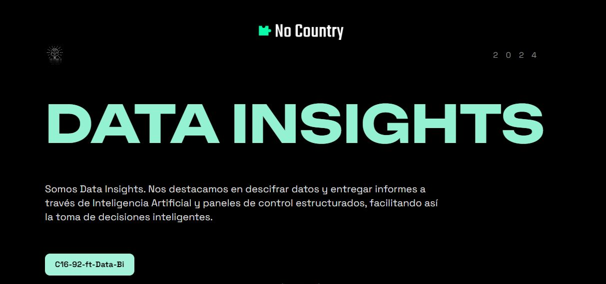
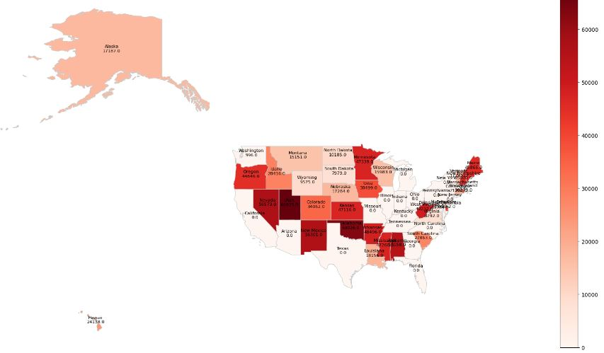
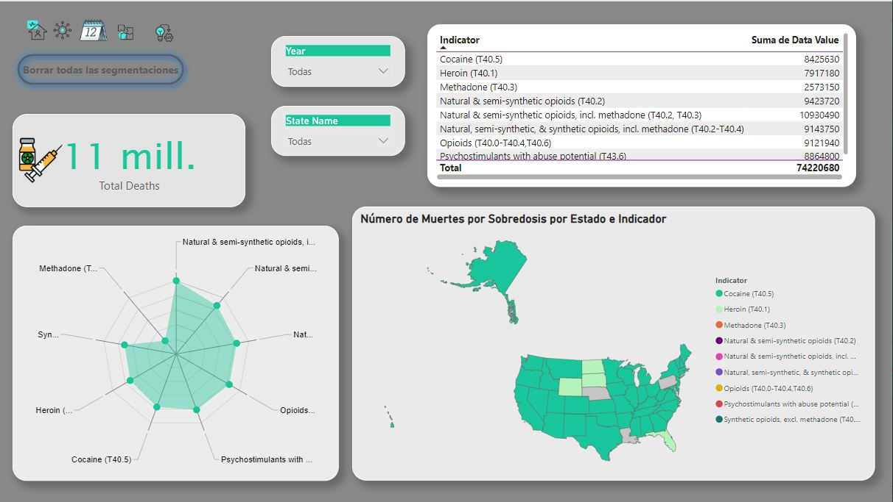
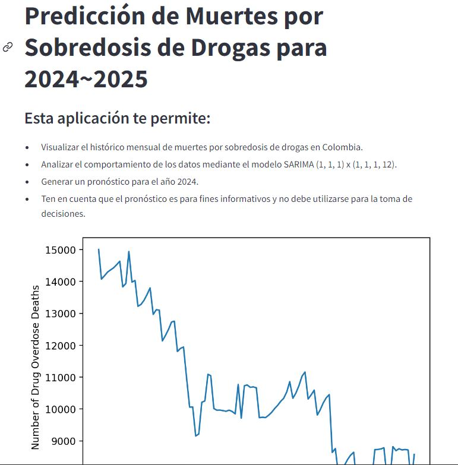

  
    

<h1 align="center"> Sobredosis de Opioides en EE.UU. </h1>

Este repositorio contiene un análisis exhaustivo de las sobredosis de opioides en Estados Unidos, un problema de salud pública que ha alcanzado proporciones alarmantes en las últimas décadas. A través de una combinación de datos estadísticos, visualizaciones informativas y análisis en profundidad. 💉🩺  

## **Objetivo y Alcance** 📚

El objetivo principal de este repositorio es proporcionar un recurso accesible y completo para el análisis y la comprensión de las tendencias de muertes por sobredosis de opioides en los Estados Unidos. Algunos de los objetivos específicos incluyen:

*Analizar la evolución de las muertes por sobredosis de opioides a lo largo del tiempo y su variación geográfica en los distintos estados. 
*Identificar patrones y tendencias significativas en los datos que puedan informar políticas de prevención y tratamiento. 
*Facilitar la investigación y el desarrollo de estrategias para abordar la crisis de opioides en los Estados Unidos. 
*Crear predicciones para los años siguientes. 
## **Fuentes de Datos** 📚

Población de  Estados Unidos - 2024  
[Link](https://worldpopulationreview.com/states)

Muertes por sobredosis de Drogas - CDC   2015-2023
[Link](https://www.cdc.gov/nchs/nvss/vsrr/drug-overdose-data.htm)

## **Análisis Exploratorio**📚

El Análisis exploratorio se realizo en notebooks de jupyter [EDA](/EDA_post_pamndemia.ipynb)  
Durante la exploración de los datos se abordaron variables que expliquen y busquen patrones en los diferentes aspectos 
* **Estado**: El estado de los Estados Unidos donde ocurrió la sobredosis. 
* **Tipo de Droga**: El tipo específico de opioides involucrado en la sobredosis.< 
* **Mes y Año**: La fecha en que ocurrió la sobredosis, desglosada por mes y año. 
* **Número de Muertes**: El número total de muertes por sobredosis de opioides reportadas. 
Dentro de lo analizado se utilizaron librerías como GeoPandas, a fin de visualizar de manera gergrafica y más representativa 

  
    

## **Creación de Reporte** 
Para este reporte se utilizo PowerBI , el que permite las visualizaciones y herramientas actualizadas, es versátil y se aloja en todas las plataformas. El enlace al tablero con el reporte esta [Aquí](https://app.powerbi.com/view?r=eyJrIjoiMGFmNzg4MTQtYzFiMi00NDcxLTkzMmEtMDUwZmY1NGY4MTQ1IiwidCI6ImRmODY3OWNkLWE4MGUtNDVkOC05OWFjLWM4M2VkN2ZmOTVhMCJ9) 

  
    

## **Modelado de Machine Learning**📚
Este proyecto predice las muertes por sobredosis de drogas usando dos
modelos de pronóstico
Este código está escrito en Python y predice la cantidad de muertes por sobredosis de
drogas. Utiliza dos modelos de pronóstico diferentes: 
● Suavizado exponencial con tendencia y estacionalidad de Holt-Winters
(SARIMA): Este es un método estadístico que predice valores futuros basado en
tendencias pasadas y patrones estacionales. 
● Prophet: Este es un modelo de aprendizaje automático desarrollado por
Facebook diseñado específicamente para el pronóstico de series de tiempo. 
El modelo se encuentra deployado en el siguiente  link: [Streamlit](https://c16-92-ft-data-bi-main-yk9zgegfgznryfjtyvl9sh.streamlit.app/)  

 

  
    

 

# **Web del proyecto** 

 El enlace a la web 

 

 
  

<!--|------------------------------------------------------------------|-------------------------------------------------------------------|----------------------------------------------------------|

  
  

 
|------------------------------------------------------------------|-------------------------------------------------------------------|----------------------------------------------------------|

  
  

 
|------------------------------------------------------------------|-------------------------------------------------------------------|----------------------------------------------------------|

  
  

 
 
|------------------------------------------------------------------|-------------------------------------------------------------------|----------------------------------------------------------|###
